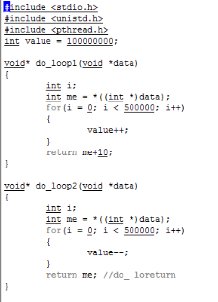
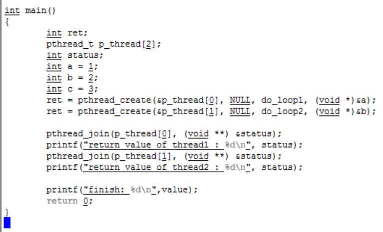
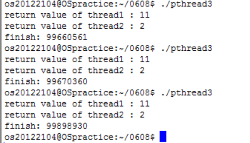
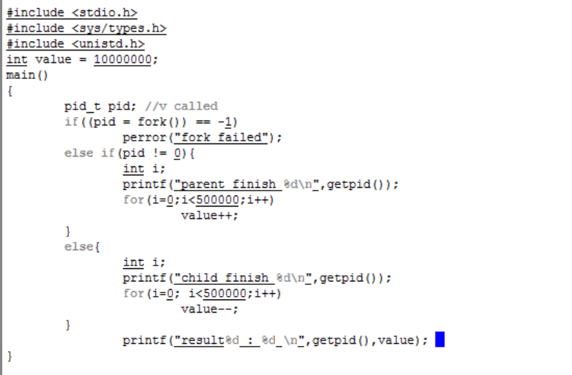
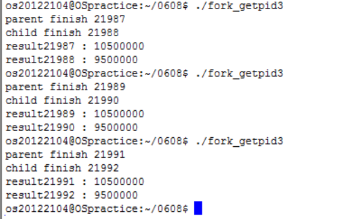
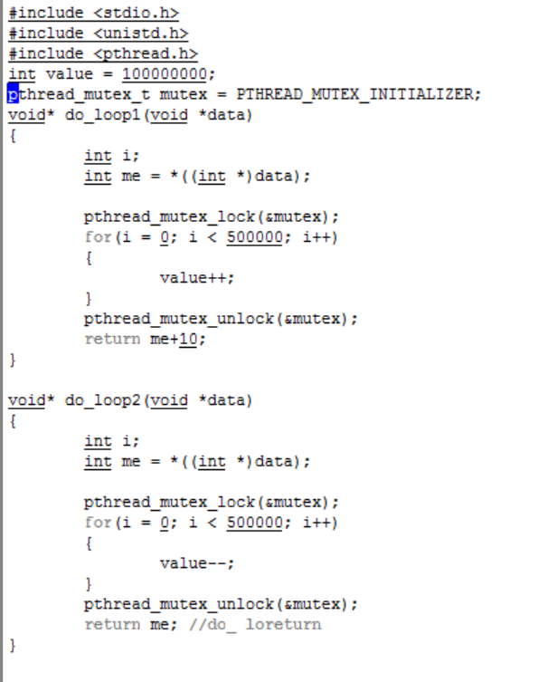
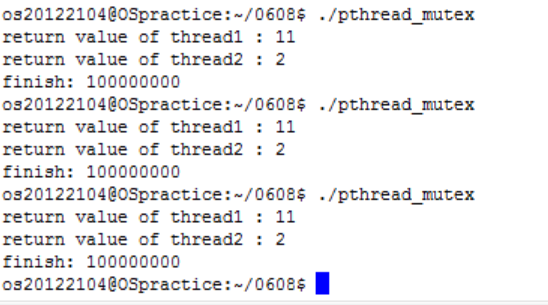

---

---

# Thread의 Process의 메모리 공유에 대한 문제점 

[TOC]

## 개요

프로세스와 스레드는 같은 전역함수를 사용할 수 있다. 하지만 같은 전역함수를 사용해도 그 결과값이 다르게 나올 수 있다. 그렇다면 왜 프로세스와 스레드는 같은 자원을 사용할 수 있을 까. 같은 자원을 사용할 수 있다면 프로세스와 스레드는 같은 개념으로 봐야 하는 가. 그렇지만 결과값이 다르다면 왜 다른 것인가. 스레드는 그리고 실행 때마다 그 값이 변화한다. 왜 그런 것일 까. 이런 문제점과 질문들을 해결하기 위해 프로세스와 스레드의 개념에 대해 정의를 내리고 프로세스와 스레드를 shell script를 통해 구현해볼 것이다. 그리고 출력한 결과값을 통해 프로세스와 스레드의 차이점에 대해 알아보고 각각의 장단점을 찾아본 뒤 스레드의 문제점과 해결방안을 찾아볼 것이다. 그리고 찾은 것을 직접 shell script에 쳐보고 결과값을 출력하여 문제점을 해결 했는지 보고 스레드의 사용에 대해 결론을 내릴 것이다.

## 프로세스 란

프로세스는 실행중인 프로그램을 말한다. 그리고 각 프로세스는 자신의 주소공간을 가지고 있다. 주소공간은 대개 텍스트 영역, 데이터 영역, 스택 영역으로 구성된다. 텍스트 영역은 프로세서가 실행하는 코드를 저장하는 영양이다. 데이터 영역은 변수들을 저장하는 영역과 프로세스가 실행 중에 사용하려고 동적으로 할당 받은 메모리 공간이다. 스택 영역은 지역변수와 명령어들을 저장하는 공간이다. 프로세스의 함수 타입은 fork() 함수이다. fork()함수는 현재의 프로세스와 동일한 프로세스를 복제하는 것이다. fork()함수의 기본형은 pid_t fork(void) 이고 반환 값은 성공 시 부모프로세스는 자식프로세스의 프로세스 아이디, 자식프로세스는 0이다. 실패 시 -1을 반환한다. 실패하는 이유는 부모프로세스가 가질 수 있는 자식프로세스의 수에 제한이 있기 때문에 초과하면 실패하게 된다. 헤더파일은 <sys/types.h>, <unistd.h>이다

|                             소스                             |                             출력                             |
| :----------------------------------------------------------: | :----------------------------------------------------------: |
|  |  |

 

## 스레드 란

스레드는 어떠한 프로그램 내에서 특히, 프로세스 내에서 실행되는 흐름의 단위를 말한다. 일반적으로 한 프로그램은 하나의 스레드를 가지고 있지만, 프로그램 환경에 따라 둘 이상의 스레드를 동시에 실행할 수 있으며 이런 실행 방식을 멀티스레드라고 한다. 한 프로세스에 속한 스레드들은 프로세스의 여러 자원을 공유한다. 스레드들은 한 프로세스에 포함된 자원의 일부를 소유한다. 프로세서 레지스터나 스택 , 신호마스크를 가지고 있고 프로세스에 있는 스레드들은 병행으로 실행되어 공통의 목표를 이루기 위해 협력이 가능하다. 그리고 멀티프로세서 시스템 은 여러 스레드들을 동시 실행을 가능하게 한다. 스레드의 함수타입은 pthread_create()로 이 함수는 스레드를 생성한다. 기본형으로는 int pthread_create(pthread _t*thread, pthread_attr_t * attr, void *(start_routine)(void*), void*arg); 이다. Thread는 스레드가 성공적으로 생성되었을 때 넘겨주는 스레드 식별번호 이고 attr은 스레드의 특성을 설정하기 위해 사용한다. 기본적으로 NULL을 사용한다. Start routine은 스레드가 수행할 함수로 함수포인터를 넘겨준다. Arg는 start routin이 실행시킬 때 넘겨줄 인자이다. Pthread_create()가 성공할 시 반환값은 thread에 식별번호를 저장하고 0을 반환한다. 실패하게 되면 에러코드를 반환한다. Pthread_create()의 헤더파일은 <pthread.h> 이다. 그리고 스레드가 종료될 때까지 기다려주는 함수는 pthread_join()이다. 스레드가 종료되지 않고 프로세스가 종료하게 되면 자원회수의 문제가 발생하게 된다. Pthread_join()의 기본형은 int pthread_join(pthread_t th, void **thread_return) 이고 th는 스레드 번호이고 thread_return은 스레드 종료시 리턴값이다. 성공 시에는 반환값이 0이고 실패하면 에러코드를 반환한다. 헤더파일은 <pthread.h>로 pthread_create()함수와 동일하다. 

|                             소스                             |                             출력                             |
| :----------------------------------------------------------: | :----------------------------------------------------------: |
|  |  |

 

## 차이점 

프로세스는 앞서 설명했던 것처럼 자신만의 주소공간, 파일, 메모리 등을 할당받는다. 그에 비해 스레드는 프로세스의 자원을 공유하기 때문에 다른 스레드와 공간과 자원을 공유하여 사용한다. 스레드는 프로세스 내에서 각각의 스택 공간을 제외한 나머지 공간과 시스템 자원을 공유한다. 그렇기에 프로세스를 이용하여 동시에 처리하던 일을 스레드로 구현할 경우의 장점은 메모리 공간은 물론 시스템 자원 소모도 현격히 줄어든다는 것이다. 그렇기 때문에 프로그램 응답시간 또한 단축이 될 수 있다. 멀티 프로세서 환경에서 스레드간의 통신이 필요한 경우 별도의 자원을 이용하는 것이 아니라 전역변수의 공간을 이용하여 데이터를 주고 받을 수 있다. 그렇기에 스레드간의 통신 방법이 더 간단하다. 

그렇다면 단점은 무엇일까. 여러 개의 스레드를 이용하는 프로그램을 작성하는 경우에 미묘한 시간 차나 잘못된 변수를 공유함으로써 오류가 발생할 수 있다. 또한 단일 프로세서 시스템에서는 멀티 프로세서 에서 보다 효과를 기대하기 어렵다.  

### 시스템 구현(증명 방법)

- 프로세스

  |                             소스                             |
  | :----------------------------------------------------------: |
  | **** |

  > 전역변수: int 타입의 value 선언
  >
  > value=10000000;
  >
  > pid_t pid: 변수를 선언 
  >
  > pid = -1: 부모 프로세스가 가질 수 있는 자식프로세스 수를 넘어섰음. (실패)
  >
  > pid!=0:
  >
  > - 부모프로세스 getpid()로 부모프로세스의 id를 부여함 
  > - 전역변수 value를 500000번 까지 증가
  >
  > pid=0: 
  >
  > - 자식프로세스 getpid()로 자식프로세스의 id를 부여
  > - 전역변수 value를 500000번 까지 감소
  >
  > result: 부모와 자식 스레드 각각 id를 주어서 출력 부분에서 확인가능

- 스레드

  | 소스                                                         |
  | ------------------------------------------------------------ |
  |  **** |

  

  > 전역변수: int 타입의 value선언
  >
  > value=100000000;
  >
  > do_loop1함수:
  >
  > - 전역변수 value를 500000번 까지 증가
  > - me+10으로 리턴을 해서 do_loop1 함수를 구분가능
  >
  > do_loop2함수: 
  >
  > - 전역변수 value를 500000번 까지 감소
  > - do_loop1함수와 다르게 me만 리턴
  >
  > main(): Pthread_create() 함수로 각각 두 개의 함수 스레드 생성

### 실행 결과

- 프로세스

  | 실행결과                                                     |
  | ------------------------------------------------------------ |
  | **** |

  > 부모 프로세스는 값은 10500000 자식 프로세스의 값은 950000으로 몇 번을 반복해도 값이 변화 없이 출력되고 있다. 

  

- 스레드

  | 실행결과                                                     |
  | ------------------------------------------------------------ |
  | **** |

  > 한 전역변수를 두 개의 스래드가 사용을 해서 그런지 계속 값이 변화하고 있다. 

## 문제점 및 해결방안 

앞서 마지막에 언급했던 것처럼 스레드간의 통신시 데이터를 주고 받는 방법은 메모리 공간을 공유하므로 즉 전역변수를 이용하여 구현한다. 공유하는 전역변수를 여러 스레드가 함께 사용하면 충돌이 생긴다. 왜냐하면 스레드가 공유자원을 서로 사용하려고 하기 때문이다. 이를 경쟁상태라고 한다. 그렇기 때문에 스레드의 실행결과에서 전역변수 value의 값이 계속 변화하는 것이다. 따라서 스레드 간에 통신할 경우에는 충돌 문제가 발생하지 않도록 동기화 문제를 해결해야 한다. 이를 해결하기 위해 접근을 제어해서 스레드들의 충돌을 막고 한번에 한 스레드만 작동이 되도록 한다. 그러기 위해 사용하는 것이 mutex 잠금이다. Mutex 잠금이란 다른 스레드가 접근하지 못하는 임계영역을 만드는 것이다. 오직 하나의 스레드만 임계영역안으로 진입할 수 있게 한다. 그렇기 때문에 thread1이 자원을 모두 사용하고 임계영역을 벗어나면 thread2는 잠금을 얻게 되고 임계영역에 진입해서 자원을 사용할 수 있게 된다. 

 Mutex를 사용하기 위해서는 pthread_mutex_init() 함수와 pthread_mutex_lock() 함수 그리고 pthread_mutex_unlock()함수가 필요하다. Pthread_mutex_init()함수를 이용하면 mutex 잠금객체를 만들 수 있다. 이 함수는 두 개의 인자를 필요로 한다. pthread_mutex_init(pthread_mutex_t *mutex, const pthread_mutex_attr *attr); 인데, mutex는 mutex 잠금 객체이고 mutex_attr는 mutex 타입을 결정한다. pthread_mutex_lock()함수는 mutex 잠금을 얻기 위한 함수이다. Pthread_mutex_unlock() 함수는 mutex 잠금을 되돌려주는 함수이다. 

| 소스                                                         | 출력                                                         |
| ------------------------------------------------------------ | ------------------------------------------------------------ |
|  |  |
| Pthread_mutex_lock()와 pthread_mutex_unlock()을 사용해 각각 두 개의 스레드 안에서 <for> 위에와 <return>위에까지 임계영역을 지정했다. | 출력 결과에서 확인할 수있듯이 몇 번 반복을 해도 value의 값이 변화하지 않는다. |

## 결론

지금까지 프로세스와 스레드의 정의와 그 둘의 차이를 통해 장단점을 이야기했다. 그리고 스레드의 가장 큰 장점인 프로세스 자원의 공유에서 문제점이 발생한다는 것을 직접 확인해보았다. 그리고 그 문제점을 해결할 수 있는 방안으로 임계영역에 대해 서술했고 mutex를 사용하여 직접 임계영역을 만들어 문제를 해결해보았다. 이것을 통해 프로세스는 스레드가 아니라는 것을 보다 확실히 알 수가 있다. 한 프로세스당 할당 받은 각 자원들의 주소들이 있고 이 자원들 중 하나인 데이터 영역에서 전역변수의 값은 변화하지 않았기 때문이다. 하지만 스레드는 프로세스의 안의 흐름이기 때문에 프로세스의 일부 자원들을 공유해서 사용하고 있었다. 특히 하나 이상의 스레드들은 자원을 따로 할당받는 것이 아닌 공유해서 사용하고 있다. 이 때문에 context switching이 빠르고 필요한 자원들이 줄어들어 효율적이었다. 하지만 그 공유한다는 장점 때문에 스레드들 끼리 충돌이 발생했고 공유하는 전역변수의 값이 실행을 할 때마다 변화하는 것을 볼 수 있었다. 그래서 임계영역을 정해서 스레드들이 전역변수를 사용하는 순서를 지정해주었다.

스레드를 사용하는 것이 효율적인 것 일까. 전역변수를 잘 못 사용하면 모든 값이 잘못되고 또 일일이 임계영역을 지정해 주어야 한다. 그리고 단일 프로세서에서는 스레드를 사용할 이유가 없을 수 도 있다. 하지만 그럼에도 불구하고 스레드를 사용하는 것은 효율적이라고 결론을 지었다. 왜냐하면 최소한의 자원으로 최대한의 결과를 도출할 수 있고 그렇기 때문에 시간을 절약할 수 있기 때문이다. 스레드의 충돌이 발생하면 임계영역을 지정해주면 되기 때문에 큰 문제는 아니다. 그리고 만약 전역변수로 인해 값이 잘못되었다면 그 전역변수를 바로 고칠 수 있다. 프로세스라면 하나하나 문제점을 찾아야 할 것이다. 그렇기 때문에 병렬식으로 사용할 수 있는 스레드가 효율적이라고 결론을 내었다. 